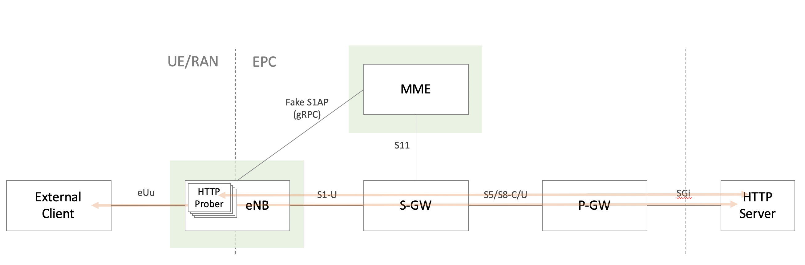

# GW Tester

A pseudo eNB and MME as a tester for S/P-GW.

## What's this?



It is a burden to use actual UE/eNB/MME just to test S/P-GW, isn't it?  
GW Tester emulates the minimal required behavior of surrounding nodes to perform a quick and simple testing on S/P-GW.

## How it works

### Authentication

Nothing!  
Subscribers defined in `enb.yml` file can immediately attach and use the created sessions. MME accepts any subscribers without authentication procedure.
Communication over S1-MME interface is done with protobuf/gRPC instead of S1AP protocol.

```
=== AD ===
Looking for a Go package for LTE authentication?
MILENAGE algorithm implementation is available :)

https://github.com/wmnsk/milenage
```

### Gateway Selection

No DNS lookup by TAI/APN is implemented.
MME just chooses gateways according to the mapping of source IP ranges and GW's IPs defined in `mme.yml`. This behavior might be changed in the future.

### Session Establishment

MME exchanges the real GTPv2 session establishment messages like Create/Modify/Delete Session with S-GW.

* IP address assignment  
Currently we use the IP address that is defined in `enb.yml` and the one passed by P-GW is ignored. This behavior might be changed in the future to be more practical.

* TEID allocation  
It can be both static and dynamic. Random TEID will be allocated by enb if `i_tei` in `enb.yml` is set to `0`. For outgoing TEID, the one that is allocated by S-GW will be used.

### U-Plane Data Injection

eNB forwards incoming traffic from UE or generates traffic by itself depending on the `type` in `enb.yml`.
GTP-U feature is based on [Linux Kernel GTP-U](https://www.kernel.org/doc/Documentation/networking/gtp.txt) with netlink.

| type     | behavior                                                                                                        |
|----------|-----------------------------------------------------------------------------------------------------------------|
| external | eNB encapsulates and forwards the incoming packets from `src_ip` toward the specified interface(`euu_if_name`). |
| http_get | eNB starts sending HTTP GET to the specified URL.                                                               |
| ...      | _(other types might be implemented in the future!)_                                                             |

## Getting Started

### Prerequisites

* Linux (kernel >= 4.12) with root privilege
* `net.ip_forward` enabled
* ports opened: 36412/TCP, 2123/UDP, 2152/UDP

### Run testers

Just `go get` eNB and MME.
Functional S-GW and P-GW are also available in the same directory if you need.

```shell-session
go get github.com/wmnsk/go-gtp/examples/gw-tester/enb
go get github.com/wmnsk/go-gtp/examples/gw-tester/mme
```

And run them with YAML configuration. See [Configuration](#configurations) section for details.

```shell-session
./mme
```

```shell-session
./enb
```

Then you'll see;

* MME starts sending GTPv2 Create Session Request to S-GW after it receives subscriber information from eNB.
* When session is successfully created on S/P-GW, eNB sets up GTP-U tunnels with S-GW.

After successful creation of the sessions, you can inject packets externally or generate it on eNB.

## Configurations

### eNB

#### Global

These values are used to identify eNB. Some of them are just to set inside the packets, and not validated.

| config     | type of value | description                |
|------------|---------------|----------------------------|
| `mcc`      | string        | MCC of eNB                 |
| `mnc`      | string        | MNC of eNB                 |
| `rat_type` | uint8         | RAT Type (`6` for E-UTRAN) |
| `tai`      | uint16        | TAI of eNB                 |
| `eci`      | uint32        | ECI of eNB                 |

#### Local Addressess

`local_addresses` are the IP addresses/ports to be bound on local machine.

| config | type of value | description                        |
|--------|---------------|------------------------------------|
| `s1c`  | string        | local IP/Port for S1-MME interface |
| `s1u`  | string        | local IP/Port for S1-U interface   |

#### Subscribers

`subscribers` are the list of subscribers to attach.

| config               | type of value | description                                                                                                                                                                 |
|----------------------|---------------|-----------------------------------------------------------------------------------------------------------------------------------------------------------------------------|
| `imsi`               | string        | IMSI of the subscriber                                                                                                                                                      |
| `msisdn`             | string        | MSISDN of the subscriber                                                                                                                                                    |
| `imeisv`             | string        | IMEISV of the subscriber                                                                                                                                                    |
| `src_ip`             | string        | sourcce IP of the subscriber (not assigned by P-GW)                                                                                                                         |
| `i_tei`              | uint32        | incoming TEID that S-GW should to specify this subscriber                                                                                                                   |
| type                 | string        | `external` or `http_get`. see [U-Plane Data Injection](#u-plane-data-injection)                                                                                             |
| `euu_if_name`        | string        | name of network interface on eUu side.</br>type=`external`: Used to receive traffic from external UE</br>type=`http_get`: Used as a source interface that `src_ip` is added |
| `http_url`           | string        | URL to HTTP GET by built-in traffic generator                                                                                                                               |
| `reattach_on_reload` | bool          | whether to perform attach procedure again on config reload                                                                                                                  |
### MME

#### Global

These values are used to identify MME. Some of them are just to set inside the packets, and not validated.

| config | type of value | description                        |
|--------|---------------|------------------------------------|
| `mcc`  | string        | MCC of MME                         |
| `mnc`  | string        | MNC of MME                         |
| `apn`  | string        | APN assigned to all the subscriber |

#### Local Addressess

`local_addresses` are the IP addresses/ports to be bound on local machine.

| config | type of value | description                        |
|--------|---------------|------------------------------------|
| `s1c`  | string        | local IP/Port for S1-MME interface |
| `s11`  | string        | local IP/Port for S11 interface    |

#### Gateway IPs

IP addresses required to know/tell S-GW. This is normally done by DNS lookup with APN, but for now it's static.

| config       | type of value | description                  |
|--------------|---------------|------------------------------|
| `sgw_s11_ip` | string        | S-GW's IP for S11 interface  |
| `pgw_s5c_ip` | string        | P-GW's IP for S5-C interface |

### S-GW

#### Local Addressess

`local_addresses` are the IP addresses/ports to be bound on local machine.

| config | type of value | description                      |
|--------|---------------|----------------------------------|
| `s11`  | string        | local IP/Port for S11 interface  |
| `s1u`  | string        | local IP/Port for S1-U interface |
| `s5c`  | string        | local IP/Port for S5-C interface |
| `s5u`  | string        | local IP/Port for S5-U interface |


### P-GW

#### Global

| config         | type of value | description                                                            |
|----------------|---------------|------------------------------------------------------------------------|
| `sgi_if_name`  | string        | name of network interface on SGi side. Used to downlink route traffic. |
| `route_subnet` | string        | IP subnet of UEs that should be routed properly.                       |

#### Local Addressess

`local_addresses` are the IP addresses/ports to be bound on local machine.  
_Note that `sgi` is just an IP address, no port number expected._

| config | type of value | description                      |
|--------|---------------|----------------------------------|
| `s5c`  | string        | local IP/Port for S5-C interface |
| `s5u`  | string        | local IP/Port for S5-U interface |
| `sgi`  | string        | local IP for SGi interface       |

## Other Features

### Reloading config

The programs can handle `SIGHUP` to reload config without deleting sessions. Update YAML file and send `SIGHUP` to the process.

### (WIP) Instrumentation

_(Metrics exposure for Prometheus is work in progress... stay tuned!)_
